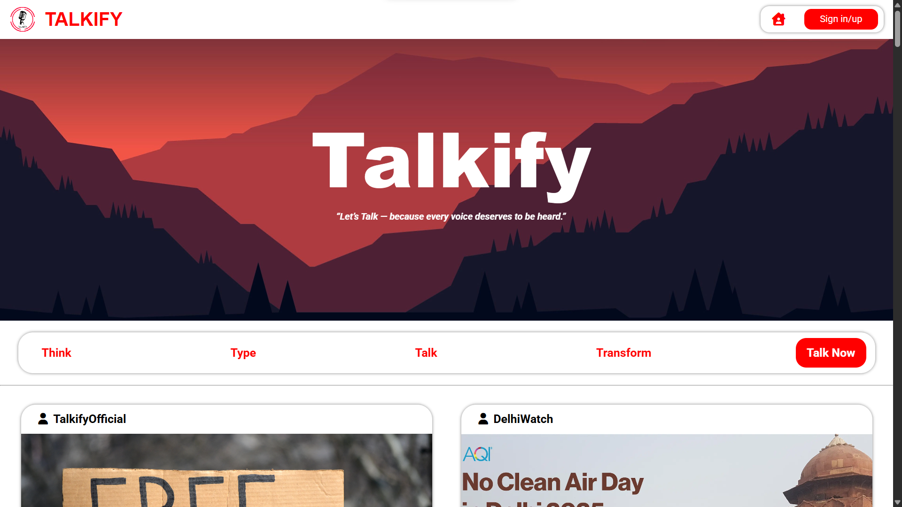
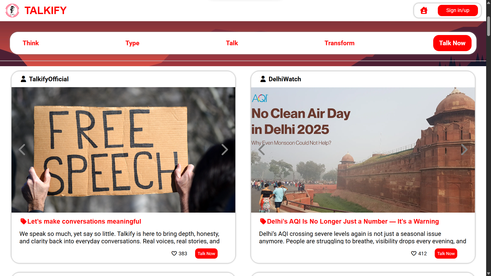
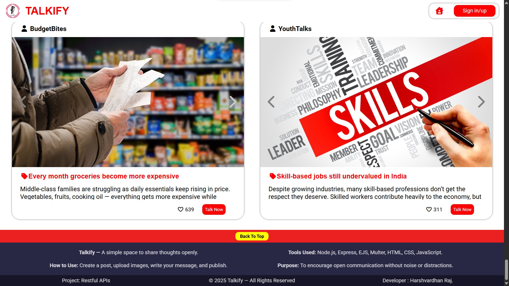
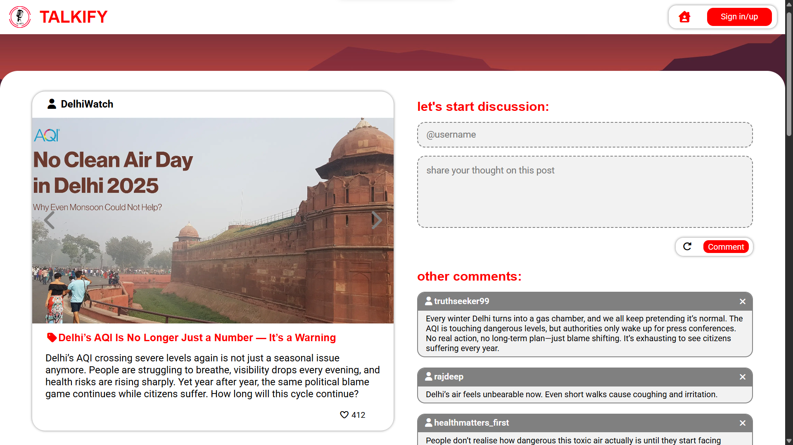
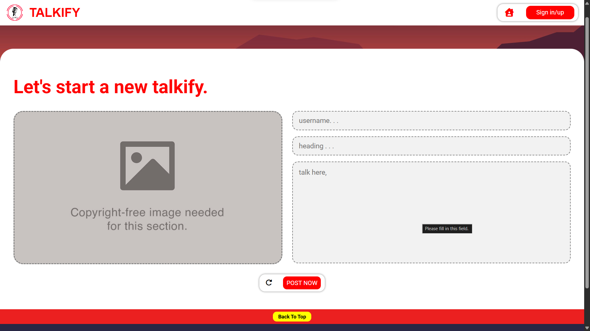

# Talkify Project

A modern full-stack web application built with Node.js and Express, focused on performing complete CRUD operations using a RESTful API. The front-end is clean, responsive, and built with HTML5, CSS3, and JavaScript.

## Table of Contents
- [About](#about)
- [Features](#features)
- [Tech Stack & Usage](#tech-stack--usage)
- [Future Enhancements](#Future-Enhancements)
- [Installation](#installation)
- [API Endpoints](#api-endpoints)
- [Usage](#usage)
- [Contributing](#contributing)
- [License](#license)
- [Contact](#contact)

## About
Talkify is a CRUD-based project that allows users to Create, Read, Update, and Delete data through a fully functional REST API. The backend is built using Node.js and Express, while the front-end provides a smooth and responsive interface for interacting with the API.

## Features
- Complete CRUD operations
- RESTful API architecture
- Responsive front-end UI
- Clean and modern design
- Organized folder structure
- Fast and lightweight backend

## Tech Stack & Usage

### **HTML5**
Used for creating the structure and layout of the web pages.

### **CSS3**
Used for styling, layout design, responsiveness, and UI enhancements.

### **JavaScript**
Used for front-end interactivity, DOM manipulation, and sending API requests.

### **Node.js**
Used as the runtime environment to run the backend JavaScript code.

### **Express.js**
Used to build the backend server, define routes, and handle API logic effectively.

### **RESTful API**
Used to structure the CRUD endpoints in a clean, scalable, and standardized format.

---

## 📸 Screenshots
,
,
,
,

## 🔮 Future Enhancements

This project is actively growing. In upcoming versions, we plan to add:

### **1. User Authentication System**
- Login / Signup pages  
- JWT-based authentication  
- Role-based access (Admin / User)

### **2. Real Database Integration**
- MongoDB / MySQL support  
- Store and fetch CRUD data from a real database  
- Add schema validation

### **3. Improved UI/UX**
- Modern dashboard for managing items  
- Theme improvements  
- Better error handling and form validations

### **4. Advanced API Features**
- Pagination  
- Search & filter functionality  
- Sorting options  
- Global error handler

### **5. User Content Editing**
- Users can *edit their own posts*
- Users can *edit their own comments*
- Permission-based editing system

### **6. Complete Front-End + Backend Deployment**
- Deployment on Render / Vercel / Railway  
- Environment variable configuration  
- Production-ready API security

### **7. Additional Modules**
- User profile management  
- Image upload support  

These updates will make Talkify more scalable, secure, and feature-rich.

## Installation

1. Clone the repository:
   
   git clone https://github.com/the-hvr/talkify.git
   cd talkify
   npm install
   npm start
   http://localhost:8080

## Usage

- Use the front-end interface to add, view, edit, or delete items.

- All operations communicate with the backend using REST API calls.

- Modify the API routes or database connection (if added later) as per your need.

- You can extend the project by adding user authentication, database storage, or advanced UI components.

## Contributing

Contributions are welcome!
To contribute:

- Fork the repository

- Create a new branch

- Make your changes

- Submit a pull request

## License

This project is licensed under the MIT License.

## Contact

- Developer: Harshvardhan Raj
- GitHub: https://github.com/the-hvr
- Email: thehvr1@gmail.com   
